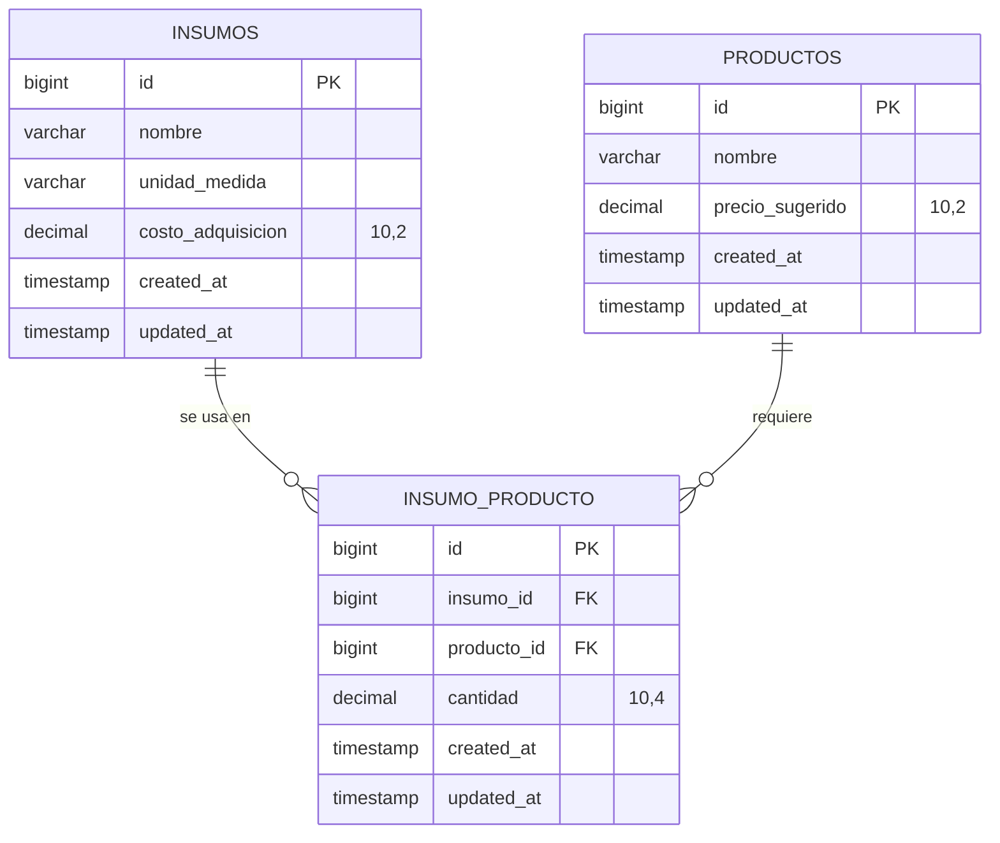

# 🧊 ESTADO DEL PROYECTO — Raspados Yeti ERP/CRM

> **Documento Vivo** — Se actualiza automáticamente tras cada módulo completado, tabla creada o decisión arquitectónica.

---

## 1. Objetivo General

Desarrollar una plataforma web tipo **ERP/CRM** para **Raspados Yeti**, un negocio de logística y servicio de snacks para eventos sociales. La plataforma busca automatizar y centralizar:

- **Costeo de productos**: Cálculo automático de precios basado en recetas e insumos.
- **Gestión de inventario**: Control de materia prima y productos terminados.
- **Gestión de clientes y eventos**: CRM para seguimiento de clientes y sus eventos.
- **Logística de servicio**: Coordinación de entregas y servicios para eventos.

---

## 2. Stack Tecnológico

| Capa        | Tecnología      | Versión   | Notas                              |
|-------------|-----------------|-----------|-------------------------------------|
| **Backend** | Laravel (PHP)   | 11.x      | API REST, Eloquent ORM, Migraciones |
| **Frontend**| Astro           | (por definir) | SSG/SSR con componentes reactivos |
| **Estilos** | Tailwind CSS    | (por definir) | Utilidades CSS                    |
| **Base de Datos** | SQLite (dev) / MySQL (prod) | — | SQLite en desarrollo local |
| **Lenguaje**| PHP 8.2+        | 8.2.12    | Con tipado estricto                 |

---

## 3. Estructura de Carpetas Actual

```
raspados-yeti/
├── app/
│   ├── Models/
│   │   ├── User.php              # Modelo de usuario (Laravel default)
│   │   ├── Insumo.php            # ✅ Modelo de materia prima
│   │   ├── Producto.php          # ✅ Modelo de producto final
│   │   └── Cotizacion.php        # ✅ Modelo de cotizacion
│   ├── Http/
│   │   └── Controllers/
│   │       └── Api/V1/
│   │           ├── InsumoController.php   # ✅ CRUD API de insumos
│   │           ├── ProductoController.php # ✅ CRUD API + Motor de Costeo
│   │           └── CotizacionController.php # ✅ CRUD API de cotizaciones
│   └── Providers/
├── bootstrap/
├── config/
├── database/
│   ├── migrations/
│   │   ├── 0001_01_01_000000_create_users_table.php
│   │   ├── 0001_01_01_000001_create_cache_table.php
│   │   ├── 0001_01_01_000002_create_jobs_table.php
│   │   ├── 2026_04_28_210000_create_insumos_table.php          # ✅ Módulo A
│   │   ├── 2026_04_28_210001_create_productos_table.php        # ✅ Módulo A
│   │   └── 2026_04_28_210002_create_insumo_producto_table.php  # ✅ Módulo A
│   │   ├── 2026_04_29_130000_create_cotizaciones_table.php     # ✅ Cotizaciones
│   │   ├── 2026_04_29_130010_create_cotizacion_producto_table.php # ✅ Cotizaciones
│   │   └── 2026_04_29_140000_update_cotizaciones_direccion_fields.php # ✅ Direccion detallada
│   └── database.sqlite
│   │           └── CotizacionController.php # ✅ CRUD API de cotizaciones
├── docs/
│   └── ESTADO_DEL_PROYECTO.md    # 📋 Este archivo
├── public/
├── resources/
├── routes/
│   ├── api.php                   # ✅ Rutas API v1 (Módulo A)
│   ├── console.php
│   └── web.php
│   │   ├── 2026_04_29_130000_create_cotizaciones_table.php     # ✅ Cotizaciones
│   │   ├── 2026_04_29_130010_create_cotizacion_producto_table.php # ✅ Cotizaciones
│   │   └── 2026_04_29_140000_update_cotizaciones_direccion_fields.php # ✅ Direccion detallada
├── storage/
├── tests/
├── vendor/
└── frontend/                         # ✅ Proyecto Astro (Frontend)
    ├── src/
    │   ├── layouts/
    │   │   └── Layout.astro           # ✅ Layout base con sidebar
    │   ├── pages/
    │   │   ├── index.astro            # ✅ Dashboard con KPIs
    │   │   ├── insumos.astro          # ✅ Tabla de materia prima + CRUD
    │   │   ├── productos.astro        # ✅ Creador de productos y recetas
    │   │   ├── cotizador.astro        # ✅ Motor de Costeo interactivo
    │   │   └── historial.astro        # ✅ Historial de cotizaciones
    │   └── styles/
    │       └── global.css             # ✅ Design system Tailwind v4
    ├── astro.config.mjs
    └── package.json
```

---

## 4. Módulos del Sistema

### ✅ Módulo A: Motor de Costeo — Base de Datos
**Estado**: Completado  
**Fecha**: 2026-04-28  

#### Tablas Creadas

| Tabla             | Descripción                                | Migración                     |
|-------------------|--------------------------------------------|-------------------------------|
| `insumos`         | Materia prima a granel + stock y categoria | `2026_04_28_210000_create_insumos_table` |
| `productos`       | Snacks / productos finales                 | `2026_04_28_210001_create_productos_table` |
| `insumo_producto` | Tabla pivote — Recetas (relación N:M)      | `2026_04_28_210002_create_insumo_producto_table` |
| `cotizaciones`    | Cotizaciones con datos del cliente y direccion detallada | `2026_04_29_130000_create_cotizaciones_table` |
| `cotizacion_producto` | Tabla pivote — Productos por cotizacion | `2026_04_29_130010_create_cotizacion_producto_table` |

#### Esquema de Base de Datos



#### Relaciones Eloquent

| Modelo     | Relación         | Modelo Destino | Tabla Pivote      | Campos Pivote       |
|------------|------------------|----------------|-------------------|----------------------|
| `Insumo`   | `belongsToMany`  | `Producto`     | `insumo_producto` | `cantidad`, timestamps |
| `Producto` | `belongsToMany`  | `Insumo`       | `insumo_producto` | `cantidad`, timestamps |

#### Método de Cálculo

El modelo `Producto` incluye el método `calcularCostoProduccion()` que:
1. Obtiene todos los insumos del producto vía la relación.
2. Multiplica `costo_adquisicion` × `cantidad` (pivot) para cada insumo.
3. Suma todos los costos parciales para obtener el **costo de producción base**.

```php
// Ejemplo de uso:
$producto = Producto::with('insumos')->find(1);
$costoBase = $producto->calcularCostoProduccion(); // Retorna ej. 17.75
```

### ✅ Módulo A: Motor de Costeo — Controladores y API REST
**Estado**: Completado  
**Fecha**: 2026-04-28  

#### Controladores Creados

| Controlador | Namespace | Métodos | Archivo |
|-------------|-----------|---------|--------|
| `InsumoController` | `App\Http\Controllers\Api\V1` | `index`, `store`, `show`, `update`, `destroy` | `app/Http/Controllers/Api/V1/InsumoController.php` |
| `ProductoController` | `App\Http\Controllers\Api\V1` | `index`, `store`, `show`, `update`, `destroy`, `calcularCostoBase` | `app/Http/Controllers/Api/V1/ProductoController.php` |

#### API Endpoints — Módulo A

| Método | Endpoint | Descripción | Respuesta |
|--------|----------|-------------|----------|
| `GET` | `/api/v1/insumos` | Listar insumos (paginado) | Lista paginada con total |
| `POST` | `/api/v1/insumos` | Crear nuevo insumo | Insumo creado (201) |
| `GET` | `/api/v1/insumos/{id}` | Ver insumo con productos asociados | Insumo + productos que lo usan |
| `PUT` | `/api/v1/insumos/{id}` | Actualizar insumo | Insumo actualizado |
| `DELETE` | `/api/v1/insumos/{id}` | Eliminar insumo | Confirmación |
| `GET` | `/api/v1/productos` | Listar productos (paginado) | Lista con conteo de insumos |
| `POST` | `/api/v1/productos` | Crear producto (con receta opcional) | Producto + receta (201) |
| `GET` | `/api/v1/productos/{id}` | Ver producto con receta completa | Producto + insumos pivote |
| `PUT` | `/api/v1/productos/{id}` | Actualizar producto y/o receta | Producto actualizado |
| `DELETE` | `/api/v1/productos/{id}` | Eliminar producto | Confirmación |
| `GET` | `/api/v1/productos/{id}/costo-base` | **★ Motor de Costeo** | Desglose + costo base + margen |
| `POST` | `/api/v1/cotizaciones` | Guardar cotizacion persistida | Cotizacion + totales |
| `GET` | `/api/v1/cotizaciones` | Listado de cotizaciones | Lista completa |
| `GET` | `/api/v1/cotizaciones/{id}/pdf` | Descargar PDF guardado | Archivo PDF |

#### Formato de Respuesta JSON Estandarizado

```json
{
  "exito": true,
  "mensaje": "Descripción legible de la operación.",
  "datos": { ... }
}
```

#### Ejemplo: Respuesta del Motor de Costeo

```json
{
  "exito": true,
  "mensaje": "Costeo del producto 'Trole de 8oz' calculado correctamente.",
  "datos": {
    "producto": { "id": 1, "nombre": "Trole de 8oz" },
    "desglose": [
      { "insumo": "Jarabe de Fresa", "cantidad": 0.25, "unidad_medida": "litros", "costo_unitario": 50.00, "subtotal": 12.50 },
      { "insumo": "Hielo Triturado", "cantidad": 0.15, "unidad_medida": "kg", "costo_unitario": 15.00, "subtotal": 2.25 },
      { "insumo": "Vaso 8oz", "cantidad": 1.00, "unidad_medida": "piezas", "costo_unitario": 3.00, "subtotal": 3.00 }
    ],
    "costo_produccion_base": 17.75,
    "precio_sugerido": 35.00,
    "margen_ganancia": 17.25
  }
}
```

#### Validaciones Implementadas

| Campo | Regla | Controlador |
|-------|-------|---------|
| `nombre` | `required`, `string`, `max:255` | Ambos |
| `unidad_medida` | `required`, `string`, `max:50` | Insumo |
| `costo_adquisicion` | `required`, `numeric`, `min:0` | Insumo |
| `stock_actual` | `nullable`, `numeric`, `min:0` | Insumo |
| `stock_minimo` | `nullable`, `numeric`, `min:0` | Insumo |
| `categoria` | `nullable`, `string`, `max:80` | Insumo |
| `precio_sugerido` | `nullable`, `numeric`, `min:0` | Producto |
| `receta.*.insumo_id` | `integer`, `exists:insumos,id` | Producto |
| `receta.*.cantidad` | `numeric`, `min:0.0001` | Producto |
| `municipio` | `required`, `string`, `max:120` | Cotizacion |
| `colonia` | `required`, `string`, `max:120` | Cotizacion |
| `calle_numero` | `required`, `string`, `max:160` | Cotizacion |
| `descripcion_lugar` | `nullable`, `string`, `max:500` | Cotizacion |

---

## 5. Decisiones Arquitectónicas

| #  | Decisión                                                    | Razón                                                                   |
|----|--------------------------------------------------------------|-------------------------------------------------------------------------|
| 1  | Nombres de tablas y columnas en español                      | Alineación con el dominio de negocio y equipo hispanohablante            |
| 2  | `decimal(10,4)` para cantidad en receta                      | Permite fracciones muy precisas (ej. 0.0625 litros = 62.5 ml)           |
| 3  | `decimal(10,2)` para valores monetarios                      | Precisión estándar para moneda MXN                                       |
| 4  | Índice `unique` compuesto en `[insumo_id, producto_id]`      | Evita duplicados: un insumo solo puede aparecer una vez por receta       |
| 5  | `onDelete('cascade')` en claves foráneas de la tabla pivote  | Al eliminar un insumo o producto, se limpian automáticamente las recetas |
| 6  | Método `calcularCostoProduccion()` en el modelo Producto     | Encapsula la lógica de negocio directamente en el dominio                |
| 7  | SQLite para desarrollo, MySQL para producción                | Desarrollo rápido sin dependencias externas; MySQL para robustez en prod |
| 8  | Controladores en namespace `Api\V1`                         | Versionado de API para compatibilidad futura con breaking changes         |
| 9  | `apiResource()` para rutas CRUD estándar                     | Genera las 5 rutas REST automáticamente siguiendo convención Laravel      |
| 10 | Formato JSON estandarizado `{exito, mensaje, datos}`         | Consistencia en todas las respuestas para facilitar integración frontend  |
| 11 | Receta opcional al crear producto, `sync()` al actualizar    | Flexibilidad: crear producto vacío o con receta; actualizar reemplaza     |
| 12 | Endpoint de costeo devuelve desglose + margen                | El frontend obtiene toda la información financiera en una sola llamada    |
| 13 | Laravel Sanctum instalado para autenticación API             | Preparado para proteger endpoints cuando se implemente login              |
| 14 | Astro v6 + Tailwind CSS v4 para frontend                     | SSG moderno + CSS nativo sin config adicional, rendimiento óptimo         |
| 15 | Colores custom con `@theme` (paleta Yeti Glaciar)            | Identidad visual coherente: azul glaciar, cian escarcha, verde ganancia   |
| 16 | Event delegation para contenido dinámico                     | Los onclick inline no funcionan en scripts module de Astro; delegation sí |
| 17 | CORS middleware global en Laravel                            | Permite comunicación entre Astro (port 4321) y Laravel (port 8001)        |
| 18 | Seeder `CosteoSeeder` con 10 insumos y 4 productos           | Datos realistas de Raspados Yeti para desarrollo y demo                   |

---

### ✅ Frontend — Módulo A: Motor de Costeo
**Estado**: Completado  
**Fecha**: 2026-04-28  
**Stack**: Astro v6.1.10 + Tailwind CSS v4.2.4

#### Componentes Creados

| Componente | Archivo | Descripción |
|------------|---------|-------------|
| `Layout.astro` | `src/layouts/Layout.astro` | Layout base con sidebar, header, indicador de API y slot de contenido |
| `index.astro` | `src/pages/index.astro` | Dashboard con KPIs dinámicos y accesos rápidos |
| `insumos.astro` | `src/pages/insumos.astro` | Tabla de insumos con stock, categoria, edición y eliminación |
| `productos.astro` | `src/pages/productos.astro` | Creador de productos y recetas dinámicas |
| `cotizador.astro` | `src/pages/cotizador.astro` | Motor de costeo interactivo con desglose tipo recibo |
| `global.css` | `src/styles/global.css` | Design system: paleta Yeti, tipografía Inter, sombras, scrollbar |

#### Integración Frontend ↔ API

| Página | Endpoint Consumido | Método | Descripción |
|--------|--------------------|--------|-------------|
| Dashboard | `/api/v1/insumos` | `GET` | KPI: total de insumos |
| Dashboard | `/api/v1/productos` | `GET` | KPI: total de productos |
| Insumos | `/api/v1/insumos?per_page=100` | `GET` | Listar todos para la tabla |
| Insumos | `/api/v1/insumos` | `POST` | Crear nuevo insumo (modal) |
| Insumos | `/api/v1/insumos/{id}` | `DELETE` | Eliminar insumo |
| Cotizador | `/api/v1/productos?per_page=50` | `GET` | Lista de productos seleccionables |
| Cotizador | `/api/v1/productos/{id}/costo-base` | `GET` | **★ Desglose de costeo en tiempo real** |

#### Características del Frontend

- **Tema claro** profesional con paleta Azul Glaciar (baja fatiga visual)
- **Sidebar** fijo con navegación e indicador de página activa
- **Indicador de API** en tiempo real (verde = conectada, rojo = desconectada)
- **Búsqueda en tiempo real** en la tabla de insumos (filtro client-side)
- **Modal funcional** para agregar insumos con validación
- **Stock actual/minimo y categoria** visibles en tabla de insumos con alerta de bajo stock
- **Edicion directa** de insumos desde la tabla
- **Cotizador dinamico**: cantidades por producto, margenes editables y modal de datos del cliente
- **Direccion detallada** en modal (municipio, colonia, calle/numero, descripcion)
- **PDF profesional** con multiples productos y layout basado en tablas (DomPDF)
- **Historial de cotizaciones** con descarga de PDF

> **Nota de debug**: el fallo al guardar ocurria porque el backend validaba el campo `direccion` y el frontend no enviaba la estructura esperada.
- **Barra de distribución** visual costo/margen con porcentajes
- **Estados de UI**: loading (skeleton), vacío, error de conexión
- **Event delegation** para botones dinámicos generados por JavaScript

---

## 6. Pendientes / Próximos Módulos

- [x] ~~**Módulo A — Motor de Costeo (Base de Datos)**: Migraciones, modelos y relaciones.~~
- [x] ~~**Módulo A — Motor de Costeo (Controladores y API)**: Endpoints REST para CRUD de insumos, productos y recetas.~~
- [x] ~~**Módulo A — Motor de Costeo (Frontend)**: Vistas Astro + integración fetch con la API.~~
- [x] ~~**Módulo A.2 — Costos Operativos Variables**: Cotización de evento con transporte, nómina y margen (40%).~~
- [x] **Módulo A — Cotizaciones en PDF**: Descarga de cotización profesional desde el cotizador.
- [x] **Bug Visual UTF-8**: Emojis y símbolos especiales corregidos en UI y API.
- [ ] **Módulo E — Seguridad y Auth (Sanctum)**: Proteger endpoints con autenticación.
- [ ] **Módulo B — Gestión de Inventario**: Stock actual, entradas/salidas, alertas de nivel mínimo.
- [ ] **Módulo C — Clientes y Eventos (CRM)**: Registro de clientes, eventos y cotizaciones.
- [ ] **Módulo D — Logística**: Rutas de entrega, asignación de personal, calendario.

### Nuevo Endpoint: Cotización de Evento

| Método | Ruta | Descripción |
|--------|------|-------------|
| `POST` | `/api/v1/cotizar-evento` | Cotización completa: insumos×invitados + transporte + nómina + margen 40% |

**Constantes**: $4.00/km transporte · $300/empleado · 40% margen sobre total operativo.

---

> **Última actualización**: 2026-04-29 | **Módulo completado**: Persistencia + Historial de Cotizaciones


---

## 7. Cómo Ejecutar el Proyecto

```bash
# Terminal 1: Backend (Laravel)
cd raspados-yeti
php artisan serve --port=8001

# Terminal 2: Frontend (Astro)
cd raspados-yeti/frontend
npm run dev

# Acceder a:
# Frontend: http://localhost:4321
# API:      http://localhost:8001/api/v1
```

---

> **Última actualización**: 2026-04-29 | **Módulo completado**: Exportación PDF + fix UTF-8 + stock insumos
